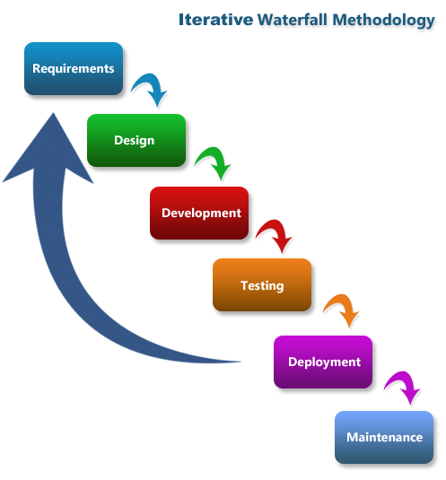

# 🦣 Approach for development

The chosen system development life cycle (SDLC) for the project aiming to minimize human-elephant conflict is the iterative waterfall model. This model follows a sequential structure, starting from preliminary investigation and requirement analysis, followed by the design phase, implementation, and maintenance

Each phase of the project consists of sub-phases that generate the desired output results. The waterfall model divides the SDLC into distinct phases, where each phase is completed before moving on to the next. This approach ensures a systematic and well-defined progression throughout the project.

The objective of using the waterfall model is to design a system that effectively reduces human-elephant conflict. The model's sequential nature allows for careful analysis of requirements, comprehensive design, successful implementation, and ongoing maintenance of the system. By following this structured approach, the project aims to create a solution that minimizes conflicts between humans and elephants in a systematic and efficient manner.

<figure><figcaption>
Iterative waterfall model
</figcaption></figure>
