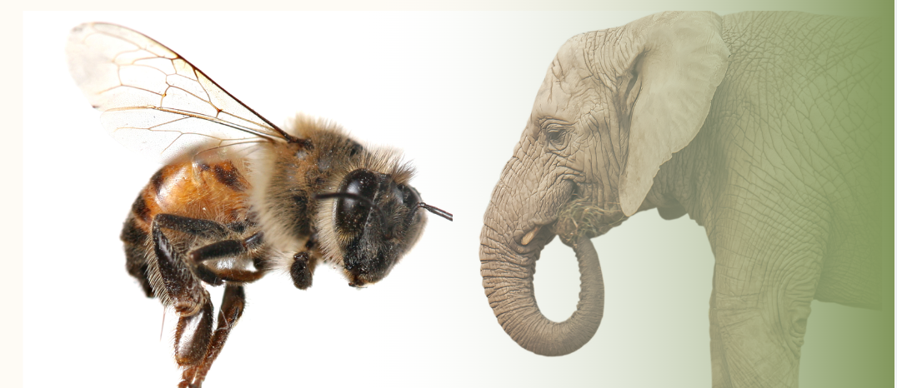
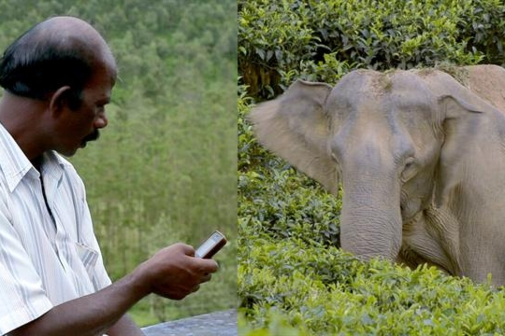

# 🐘 Main parts of the research

In my research to reduce elephant-human conflict, iot, arduino, wireless communication, midi recoding, google cloud and machine learning technologies were used to create a system to repel elephants using bee sounds. There it started to be done with technical devices in the following way. Here I did this through three steps and they are,

* Elephant Recognition
* Driving away the elephant using the sound of bees
* As the awareness of the vulnerable area

Here's a brief explanation of each step in your system to reduce elephant-human conflict:

_**Elephant Recognition:**_

The first step in this system involves utilizing IoT, Arduino, wireless communication, and machine learning to identify the presence of an elephant. This is achieved by training a machine learning model to recognize the shape and characteristics of an elephant using a dataset of labeled elephant images. The model is integrated with an Arduino-compatible device, such as the ESP32 CAM module, which captures images in the designated danger area. By analyzing these images robo flow technic (image processing), the system can determine whether an elephant is present.&#x20;

<figure><figcaption>
Identifying the Elephant
</figcaption></figure>

_**Driving Away the Elephant Using Bee Sounds:**_

Once an elephant is identified, the system aims to repel it from the vulnerable area using the sound of bees. MIDI recording technology is used to capture the sounds of bees, which are known to deter elephants due to their aversion to bee stings. The recorded bee sounds are stored in MIDI format. When an elephant is detected, the system plays back the bee sounds to create a deterrent effect, encouraging the elephant to move away from the area and minimize the potential for conflict with humans.

<figure><figcaption>
Using Bees‘ sound to repel Elephants
</figcaption></figure>

_**Raising Awareness of the Vulnerable Area:**_

In addition to repelling elephants, this system focuses on raising awareness about the vulnerable areas prone to elephant-human conflict. This step involves leveraging Google Cloud services to store, process, and analyze the data collected by the system. By uploading captured images and other relevant data to Google Cloud, you can gain insights into elephant behavior, movement patterns, and interactions with the system. This information can be shared with conservation organizations, local communities, and other stakeholders to increase awareness about the vulnerable areas and facilitate the implementation of appropriate measures to mitigate conflicts.

<figure><figcaption>
Send the message to villagers
</figcaption></figure>

Here, the villagers are informed about the location of the elephant. The villagers are informed about the location of the elephant through a short message. At the same time a warning alarm is on.

By combining these three steps, your system aims to reduce elephant-human conflict by effectively identifying elephants, repelling them using bee sounds, and raising awareness about the vulnerable areas.
