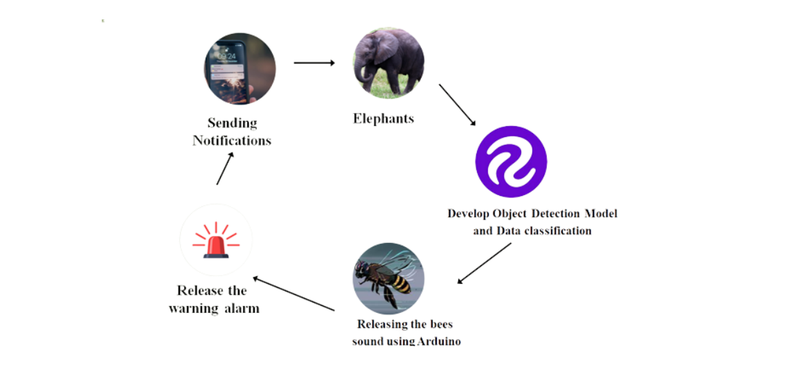

# 🐘 System Design

To achieve this goal, various innovative approaches and technologies are employed. These include advanced cam module, object detection model algorithms, and realtime monitoring systems. The research focuses on developing a system that effectively minimizes human-elephant conflicts while ensuring speed, costeffectiveness, and convenience for all involved parties, including humans, wildlife officials, and wild elephants. The system aims to create an environment where daily activities can be carried out by humans and elephants without conflicts arising. The following graphic provides a high-level overview of the proposed system, including its key parts, its services, and how they interact.

<figure><figcaption>
High Level architecture
</figcaption></figure>
