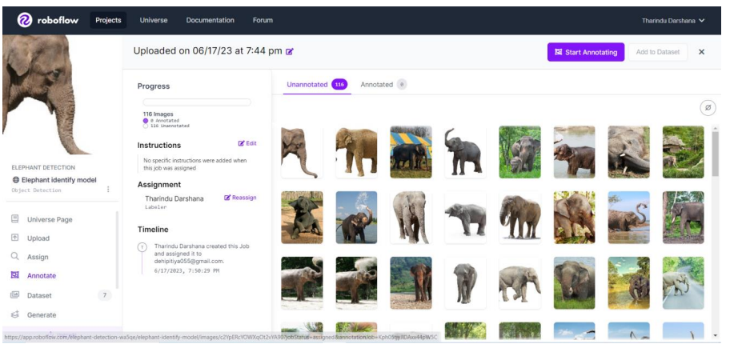
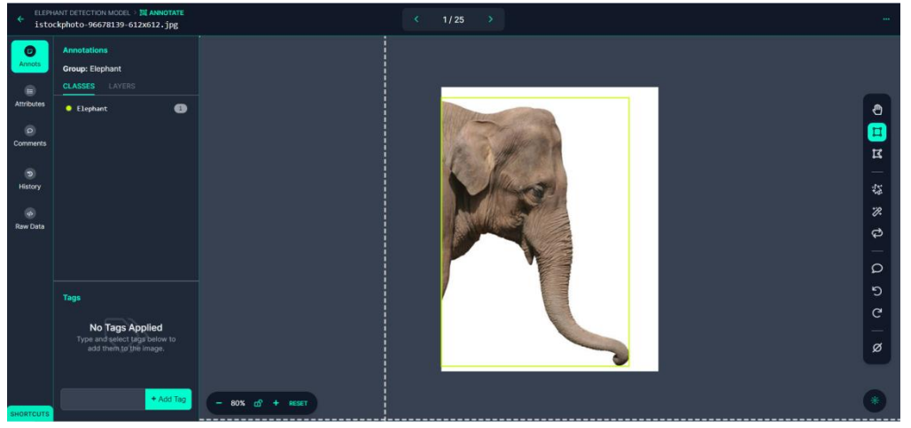

# 🍀 Elephant Detection Model Development

To develop the Elephant Recognition Model, the Roboflow technique was employed. Roboflow is a platform that provides tools and resources for training computer vision models. It facilitates the process of data preprocessing, augmentation, and model training.

The YOLOv8 algorithm was chosen due to its ability to perform object detection in real-time, making it suitable for applications that require quick identification of objects, such as elephants. This algorithm utilizes a single neural network to simultaneously predict bounding boxes and class probabilities for various objects present in an image.

* **Collecting Elephant Images:** To train a machine learning model for elephant recognition, I need a dataset of images containing elephants.

<figure><figcaption>
Robo flow Collecting Image
</figcaption></figure>

* **Data Labeling with Roboflow:** Once have the images, need to label the instances of elephants in each image. Using Roboflow, labeled the elephant instances in the collected images, providing the necessary annotations for training the model.

<figure><figcaption>
Data Labeling with Roboflow
</figcaption></figure>

**Objects Detection Model:** trained an object detection model using the labeled dataset of elephant images.

<figure><figcaption>
trained an object detection model
</figcaption></figure>

* **Training the Model:** With the labeled dataset and the object detection model architecture chosen, proceeded to train the machine learning model. During training, the model learns to recognize the visual patterns and features associated with elephants based on the labeled data. The goal is to enable the model to accurately detect and identify elephants in new, unseen images.

<figure><figcaption>
Inference and Elephant Recognition
</figcaption></figure>

Inference and Elephant Recognition - Once the model is trained and evaluated, it is ready for inference, which involves using the model to recognize elephants in new images. When presented with a new image, the model processes it through its object detection algorithm, identifying and localizing elephants by drawing bounding boxes around them.

