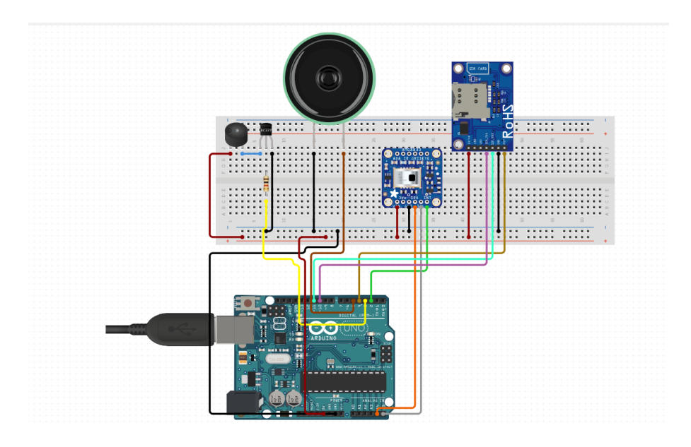

# 🍀 System Circuit Diagram

The circuit diagram illustrates the connections between various module and actuators employed in the system. This circuit diagram is a prototype of the An IOT based frequency interference system to reduce the elephant human conflict in Sri lanka.

<figure><figcaption>
System circuit diagram
</figcaption></figure>
