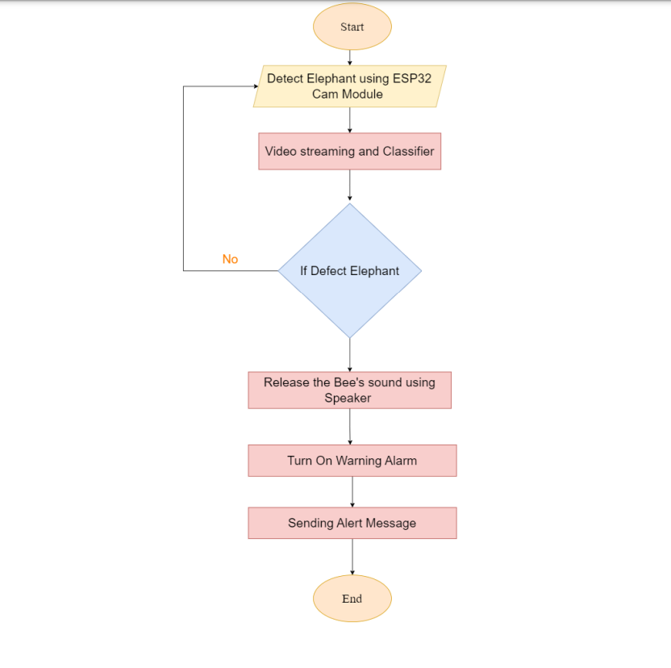

# 🍀 System Flow chart

The system has main three parts. They are Elephant Recognition, Driving away the elephant using the sound of bees, as the awareness of the vulnerable area.

<figure><figcaption>
Logical Design of the system
</figcaption></figure>
