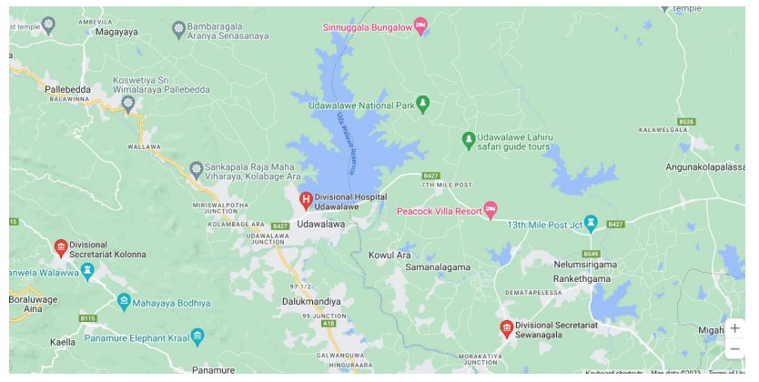

# 🐘 Study Area

The research area selected for this study is the Udawalawa area in the Rathnapura district. The Udawalawa area is chosen because it is known for being highly susceptible to human-elephant conflict. The study focuses on understanding the experiences of people directly affected by this conflict, as well as wildlife officials who struggle to manage wild elephants entering the area. The human elephant conflict has resulted in various challenges for the local population, leading to significant problems and even the loss of lives of both people and elephants.

The main users of the system implemented in this research are the people directly exposed to human-elephant conflict in the Udawalawa area. However, the study also includes people living outside the Udawalawa area as part of the population, possibly to gain insights into how human-elephant conflict impacts neighboring communities or to consider potential solutions that could have broader applicability.

<figure><figcaption>
Map Udawalawa
</figcaption></figure>

Overall, the chosen study area of Udawalawa provides a relevant and important context for investigating the effectiveness of the designed system and understanding its potential impact on reducing human-elephant conflict in vulnerable regions. The research aims to address the challenges faced by the local communities and wildlife officials, and the findings may contribute to improving coexistence between humans and elephants in this area and potentially in other similar regions as well.
