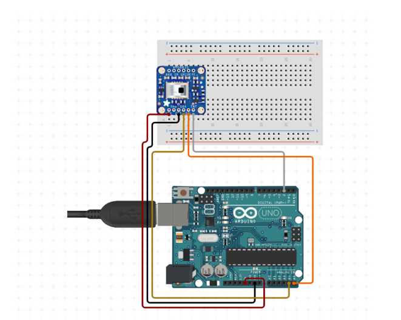

# 🐘 ESP 32 cam module initialization Ardunio

The ESP32 CAM module, equipped with the integrated model, is then installed in the designated danger area where elephants are known to appear. When an elephant enters the monitored region, the ESP32 CAM captures an image of the elephant. Camera module must be connected to the ardunio board and roboflow elephant detection model and it is done by the following code and Diagram.


<figure><figcaption><p>ESP 32 cam module connect to the Arduino board</p></figcaption></figure>

In here explain how to connect ESP32 CAM module’s pin to Arduino board’s pin.

* Connect the ESP32-CAM module's 5V and GND pins to the Arduino Uno's 5V and GND pins.
* Connect the ESP32-CAM module's TX pin to the Arduino Uno's RX pin.
* Connect the ESP32-CAM module's RX pin to the Arduino Uno's TX pin.
* If you are using a logic level converter, connect the ESP32-CAM module's TX and RX pins to the logic level converter's input pins.
* Connect the logic level converter's output pins to the Arduino Uno's TX and RX pins.


**>> The arduino code used to connect the esp 32 cam module to the arduino board is given below.**



````cpp
```cpp
#include <LiquidCrystal_I2C.h>
#define BLYNK_PRINT Serial
#include <ESP8266WiFi.h>
#include <BlynkSimpleEsp8266.h>

LiquidCrystal_I2C lcd(0x27, 16, 2);

char auth[] = "uSXBOxFI5mjSTQW64aDvOeYZT-uwI1mh";// Enter your Auth token
char ssid[] = "Tharindu";//Enter your WIFI SSIS
char pass[] = "992953098";//Enter your WIFI password
BlynkTimer timer;
int pinValue = 0;

#define Buzzer D5
#define Green D6
#define Red D7
#define Sensor A0

void setup() {
 Serial.begin(9600);
 lcd.backlight();
 lcd.init();
 pinMode(Green, OUTPUT);
 pinMode(Red, OUTPUT);
 pinMode(Buzzer, OUTPUT);
 pinMode(Sensor, INPUT);
 Blynk.begin(auth, ssid, pass);
 timer.setInterval(100L, notifiaction);
}
BLYNK_WRITE(V0) {
 pinValue = param.asInt();
}


void notifiaction() {
 int sensor = analogRead(Sensor);
 Serial.println(sensor);
 sensor = map(sensor, 0, 1024, 0, 100);

 if (pinValue == 1) {
  if (sensor <= 50) {
  digitalWrite(Green, HIGH);
  digitalWrite(Red, LOW);
  digitalWrite(Buzzer, LOW);
  lcd.setCursor(0, 1);
  lcd.print("No Elephant");
} else if (sensor > 50) {
  Blynk.notify("Elephant Here");
  digitalWrite(Green, LOW);
  digitalWrite(Red, HIGH);
  digitalWrite(Buzzer, HIGH);
  lcd.setCursor(0, 1);
  lcd.print("Gas value:High ");

 }
 lcd.setCursor(0, 0);
 lcd.print("Value : ");
 lcd.print(sensor);
 Blynk.virtualWrite(V1, sensor);
 } else {
  
 digitalWrite(Red, LOW);
 digitalWrite(Buzzer, LOW);
 digitalWrite(Green, LOW);
 lcd.clear();
 }
}
void loop() {
 Blynk.run();
 timer.run();
}
```
````


