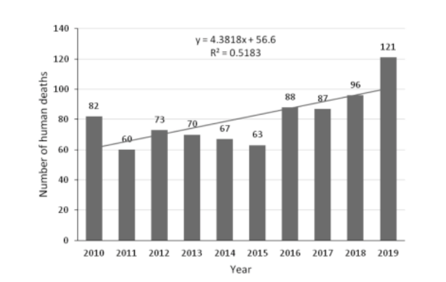
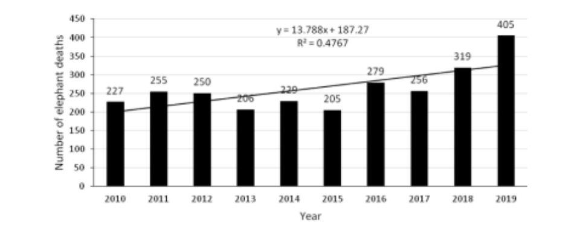
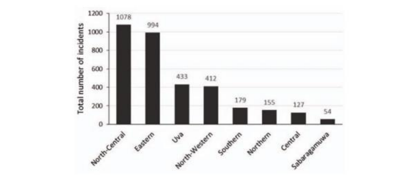
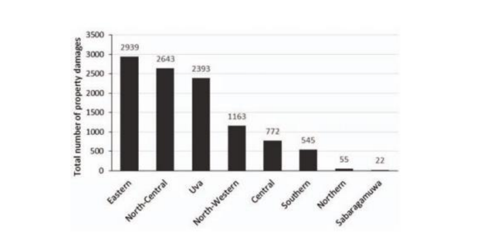

# 🦣 Human-Elephant Conflict in Sri Lanka- Patterns and Extent

From 2010 to 2019, Sri Lanka recorded a total of 14,516 incidents of Human Elephant Conflict (HEC). These incidents resulted in significant consequences, including 807 human deaths, 579 human injuries, and 10,532 cases of property damage caused by elephants. Additionally, during this period, 2,631 elephant deaths were recorded, which includes elephants that died at the Elephant Transit Home as well as cases where the specific Divisional Secretariat (DS) division was not recorded. These statistics highlight the severity and impact of HEC in Sri Lanka during the given timeframe.

<figure><figcaption>
Annual human deaths
</figcaption></figure>

<figure><figcaption>
Annual elephant deaths
</figcaption></figure>

HEC occurred in eight of the nine provinces. HEC incidents showed (human deaths and injuries, and elephant deaths combined) varying intensities between provinces with the NorthCentral and Eastern provinces showing the highest and Sabaragamuwa the lowest levels.

<figure><figcaption>
Total number of HEC incidents by province
</figcaption></figure>

Property damages recorded had a similar pattern to HEC incidents represented by injury and death except in the Uva province, which had a relatively higher incidence of property damage.

<figure><figcaption>
Total number of reported property damages by province.
</figcaption></figure>

